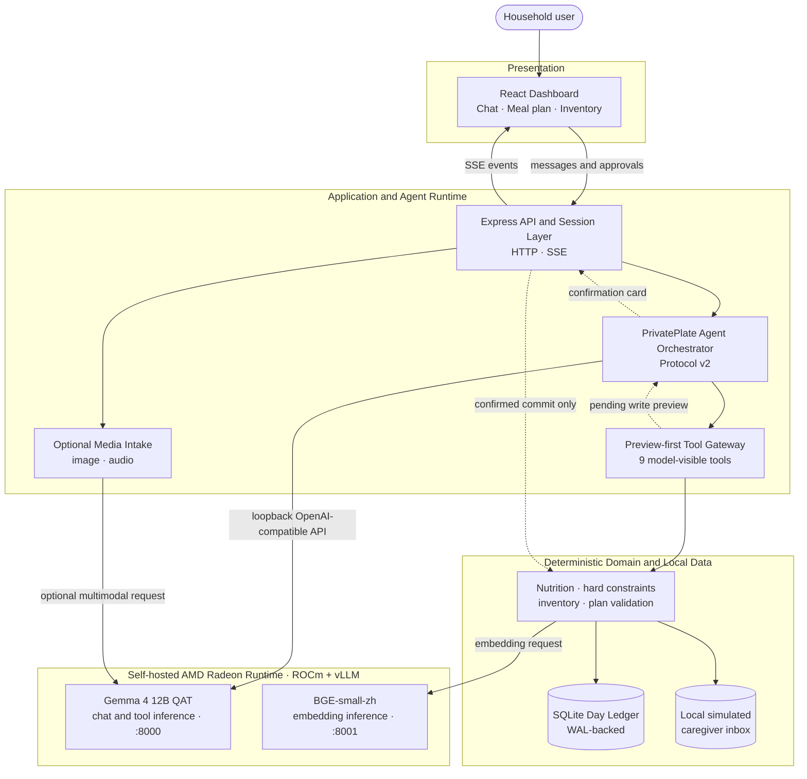

# PrivatePlate

**AMD AI DevMaster 2026 · Track 2: Development & Local Deployment of Private AI Agents**

PrivatePlate is a household meal-coordination Agent for nutrition-aware dinner planning. The language model interprets requests, manages multi-turn context, and selects from a restricted tool set. Deterministic TypeScript code owns nutrition arithmetic, dietary constraints, inventory state, plan validation, confirmation checks, and ledger writes.

The judged inference path is self-hosted on an AMD Radeon GPU through ROCm and vLLM. The application accepts only loopback model endpoints, so it does not send model requests to a third-party hosted inference API. Contest evidence was captured on an AMD-provided Radeon cloud instance; the application can connect to that user-controlled node through an SSH tunnel while both vLLM endpoints remain bound to loopback.

> Scope note: the demonstrated and benchmarked path is text chat, tool use, deterministic planning, confirmation-gated writes, and embedding RAG. Image intake is implemented in code. Audio intake is an optional path but requires vLLM audio dependencies that were not available in the recorded contest environment. Neither media path is part of the Radeon benchmark claims.

Chinese long-form documentation for development context: [`docs/README.zh.md`](docs/README.zh.md).

## Submission materials

| Deliverable | Location |
| --- | --- |
| Project Specification | [`docs/submission/PROJECT_SPECIFICATION.md`](docs/submission/PROJECT_SPECIFICATION.md) |
| AMD Radeon adaptation and optimization | [`docs/submission/AMD_RADEON_ROCM_ADAPTATION_AND_OPTIMIZATION.md`](docs/submission/AMD_RADEON_ROCM_ADAPTATION_AND_OPTIMIZATION.md) |
| Claim-to-code and evidence matrix | [`docs/submission/CLAIM_EVIDENCE_MATRIX.md`](docs/submission/CLAIM_EVIDENCE_MATRIX.md) |
| Supplementary PPT | [`docs/submission/PrivatePlate_Track2_Submission.pptx`](docs/submission/PrivatePlate_Track2_Submission.pptx) |
| Demo video | [YouTube, unlisted](https://youtu.be/2XIZmQV2vQk) |
| Submission materials guide | [`docs/submission/README.md`](docs/submission/README.md) |

## Agent architecture



**Write boundary:** the model never receives a `commit_*` tool. Model-visible write tools only create previews. A separate trusted confirmation route checks the pending action before deterministic Domain code changes SQLite state. Replaying the same confirmation is idempotent.

**Caregiver boundary:** `preview_caregiver_task` creates a privacy-filtered task card. After confirmation, the current implementation stores it in a local simulated inbox. Integration with SMS, email, or a third-party messaging service is not implemented.

## Model-visible tools

The source of truth is [`packages/agent-runtime/src/model/tool-definitions.ts`](packages/agent-runtime/src/model/tool-definitions.ts).

1. `get_day_context`: household, nutrition budget, current intake, inventory, and member memory
2. `get_inventory`: explicit inventory lookup
3. `find_dish_candidates`: deterministic hard-filtered candidates
4. `finalize_meal_plan`: validate the Agent's complete dish selection and compute nutrition and shopping gaps
5. `retrieve_local_knowledge`: retrieve from the local knowledge corpus
6. `preview_caregiver_task`: create a privacy-filtered caregiver task preview
7. `preview_meal_completion`: preview an "ate as planned" ledger write
8. `preview_inventory_change`: preview an inventory write
9. `preview_member_memory_change`: preview a member-memory write

## Implemented product scope

| Capability | Status and boundary |
| --- | --- |
| Text meal planning | Implemented and demonstrated through the real Agent and Radeon-hosted model |
| Hard dietary constraints and nutrition arithmetic | Implemented in deterministic Domain code |
| Multi-turn revisions | Implemented, including full-plan resubmission and checkpointed session state |
| Local embedding RAG | Implemented with BGE on the Radeon node; offline hash mode exists for tests only |
| Inventory, memory, and meal-completion writes | Implemented with preview, confirmation, and idempotency checks |
| Caregiver handoff | Implemented as a privacy-filtered preview plus confirmed local simulated inbox write |
| Fridge image intake | Implemented; not included in the benchmark evidence |
| Spoken input | Optional code path; not verified in the contest runtime because the vLLM audio extra was unavailable |
| External caregiver delivery, grocery ordering, cooking-video search | Not implemented |

The synthetic demo catalogue contains a small household dataset and is not a clinical food database. PrivatePlate is not a medical assistant.

## Environment and dependencies

| Component | Requirement |
| --- | --- |
| Node.js | `>=22.13` |
| Package manager | npm workspaces |
| Development OS | macOS or Linux |
| Radeon path | Linux x86_64, AMD Radeon `gfx1100`, ROCm, Python 3.12, compatible vLLM wheel |

Pinned inference stack:

| Component | Pin |
| --- | --- |
| ROCm | `7.2.3` preferred; `7.2.1` was also used during earlier runs |
| vLLM | `0.25.1+rocm723` |
| Chat model | `google/gemma-4-12B-it-qat-w4a16-ct` on `127.0.0.1:8000` |
| Embedding model | `BAAI/bge-small-zh-v1.5` on `127.0.0.1:8001` |

See [`scripts/c0/stage-b/runtime-pin.json`](scripts/c0/stage-b/runtime-pin.json), [`scripts/c0/stage-b/install-plan.json`](scripts/c0/stage-b/install-plan.json), and the Radeon adaptation document for the installation and serving configuration.

## Quick start

From a clone of the contest repository:

```bash
cd submissions/track2-privateplate
npm install

# The URLs must resolve to loopback. They may be local processes or SSH tunnels
# to a user-controlled Radeon node.
export PRIVATEPLATE_RAG_MODE=vllm
export PRIVATEPLATE_VLLM_BASE_URL=http://127.0.0.1:8000/v1
export PRIVATEPLATE_MODEL_ACTIVE=google/gemma-4-12B-it-qat-w4a16-ct
export PRIVATEPLATE_EMBEDDING_BASE_URL=http://127.0.0.1:8001/v1
export PRIVATEPLATE_EMBEDDING_MODEL=BAAI/bge-small-zh-v1.5

npm run dev:server   # API on :8787
npm run dev:web      # UI on :5173
```

- UI: `http://127.0.0.1:5173`
- API: `http://127.0.0.1:8787`
- Runtime status: `curl -s http://127.0.0.1:8787/api/runtime/status`
- Demo database: `./data/privateplate-demo.sqlite`
- Reset demo data: `curl -s -X POST http://127.0.0.1:8787/api/demo/reset`
- Single-port built application: `npm start`
- Embedding helper: `bash scripts/rag/serve-bge-small.example.sh`, then `npm run rag:check`

Without `PRIVATEPLATE_RAG_MODE=vllm`, the application uses an offline hash retriever intended for tests. Results from that mode must not be described as Radeon embedding evidence.

## Verification and recorded optimization

```bash
npm run typecheck
npm run test:eval-v2
npm run check
```

These commands validate code structure and offline fixtures. They do not substitute for a real Radeon model run.

### Key metrics (diagnostic re-run — not a blind claim)

Sealed 21-case run `sealed-suite-diag-16k-20260804T161006Z-brfix`:

| Column | Result |
| --- | ---: |
| Model | **21/21** |
| Product | **17/21** |
| Safety | **21/21** |
| Real tool calls | **83/83** |

The diagnostic run passed all model and safety cases. Four domain-level product cases remained below the project's deliberately strict internal 95% Product target, which is **not** an official Track 2 scoring threshold. This run is a diagnostic re-run (`notABlindClaim`), not a blind formal score. Evidence: `benchmarks/c0/stage-b/sealed-suite-diag-16k-20260804T161006Z-brfix/`. Detailed suite status, including the project-owned internal `finalConclusion`, is recorded in that evidence directory and in [`docs/submission/CLAIM_EVIDENCE_MATRIX.md`](docs/submission/CLAIM_EVIDENCE_MATRIX.md).

Two controlled Radeon A/B summaries report:

- vLLM prefix caching: TTFT p50 **2248.31 ms → 1151.58 ms** (**−48.78%**); evidence `benchmarks/prefix-caching-ab-retry-20260803T071404Z/results/`
- Trusted terminal presenter: target E2E p50 **16882.65 ms → 4763.24 ms** (**−71.79%**), small quality check 7/9 → 9/9; evidence `benchmarks/terminal-finalization-ab-20260803T094112Z-05/results/`

These figures are project-recorded measurements, not an official leaderboard result.

## Repository layout

```text
apps/
  server/             API, SSE, sessions, confirmation, media intake
  web/                React dashboard
packages/
  contracts/          Shared schemas
  domain/             SQLite ledger, hard filters, nutrition math
  agent-runtime/      Agent loop, nine tool definitions, local vLLM provider
  evals/              Evaluation runners and scorers
fixtures/             Synthetic household and knowledge corpus
scripts/              Radeon installation, serving, RAG, and diagnostics
docs/
  submission/         Judge-facing documents and supplementary artifacts
  evidence/           Internal result summaries and runbooks
```

## License status

`package.json` currently declares `UNLICENSED`, and this repository does not grant an open-source license. Do not describe the project as open source unless a license is deliberately selected and added by the owner.