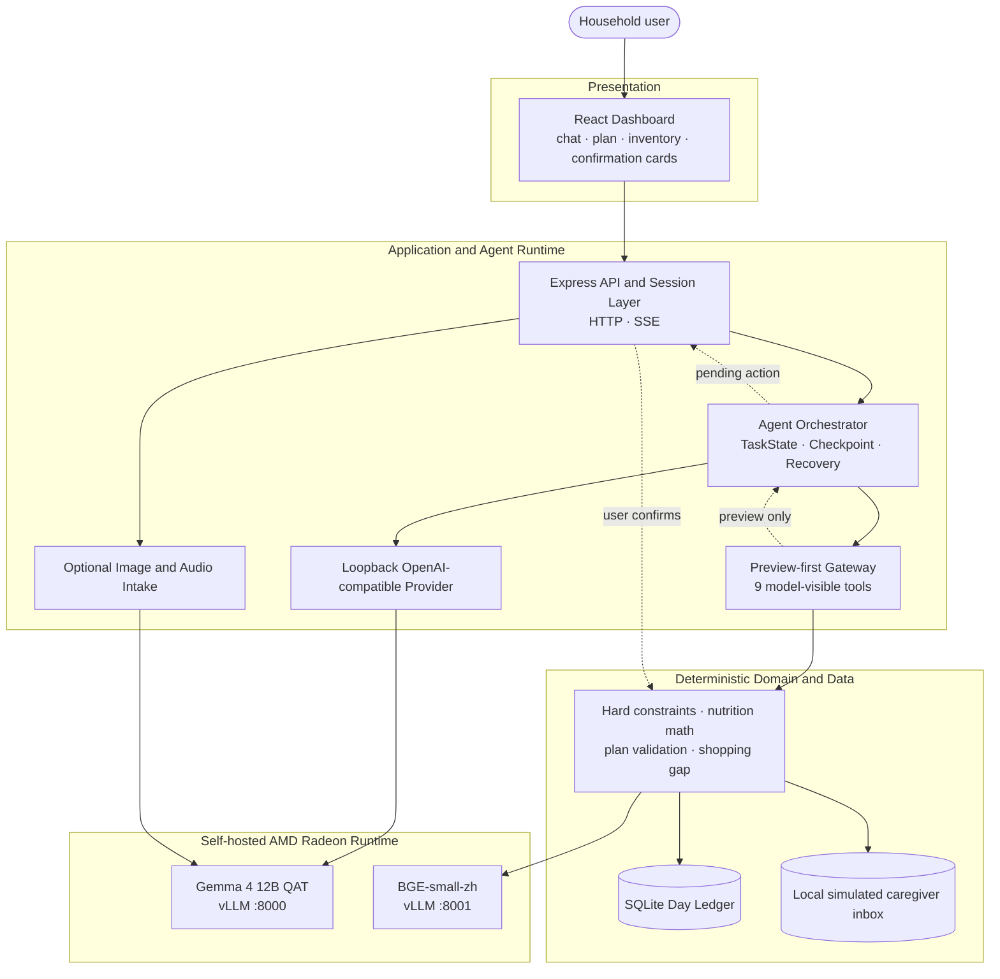

# PrivatePlate: Project Specification

**Track:** AMD AI DevMaster 2026, Track 2: Development & Local Deployment of Private AI Agents  
**Application:** PrivatePlate, a household meal-coordination Agent  
**Judge-facing language:** English  
**Inference stack:** AMD Radeon `gfx1100`, ROCm, vLLM `0.25.1+rocm723`, Gemma 4 12B QAT W4A16  
**Companion document:** [`AMD_RADEON_ROCM_ADAPTATION_AND_OPTIMIZATION.md`](./AMD_RADEON_ROCM_ADAPTATION_AND_OPTIMIZATION.md)

## 1. Application scenario

PrivatePlate is designed as a practical module for a future household-service robot or screen-based home assistant. It coordinates a household dinner by considering:

- who is eating;
- each member's hard dietary constraints and remembered preferences;
- today's remaining nutrition budget;
- available inventory;
- a local recipe and household-guidance corpus;
- user revisions such as "replace that dish";
- explicit confirmation before any persistent state change.

### Implemented contest slice

| Product step | Status in this repository |
| --- | --- |
| Text request and multi-turn meal planning | Implemented and demonstrated |
| Household member memory and hard avoid constraints | Implemented through preview and confirmation |
| Inventory lookup and confirmed inventory updates | Implemented |
| Nutrition-aware dish candidate filtering | Implemented in deterministic Domain code |
| Complete meal-plan validation and shopping-gap calculation | Implemented |
| Local knowledge retrieval | Implemented with Radeon-hosted BGE embeddings; offline hash retrieval exists for tests only |
| Replanning after a rejected dish | Implemented through multi-turn state and full-plan resubmission |
| Meal-completion recording | Implemented through preview and confirmation |
| Caregiver task handoff | Implemented as a privacy-filtered preview and a confirmed write to a local simulated inbox |
| Fridge image intake | Implemented in the server intake path; not part of the benchmark evidence |
| Spoken input | Optional code path; not verified in the contest runtime because the deployed vLLM lacked the audio extra |
| External SMS/email delivery, grocery ordering, cooking-video search | Not implemented |

The current caregiver path does not send a real message to another person. It creates a task card, asks for confirmation, and stores the confirmed task in local application state as a simulated inbox entry.

The synthetic demo household contains a small ingredient and dish catalogue. It is not a clinical nutrition database, and PrivatePlate is not a medical assistant.

### Privacy and deployment boundary

The model endpoints are required to resolve to loopback. The judged configuration uses self-hosted vLLM processes on an AMD Radeon node. Contest evidence was captured on an AMD-provided cloud Radeon instance, with the application able to access loopback endpoints through an SSH tunnel. This avoids third-party hosted model APIs without claiming that every process necessarily ran on one physical consumer PC.

## 2. Agent architecture



### Trust boundary

The model has no `commit_*` tool. Model-visible write operations return typed previews. The API and Agent session retain the pending action. Only the separate confirmation route may call deterministic commit logic after validating the pending payload and idempotency information.

This separation prevents the model from claiming that an inventory, memory, meal-completion, or caregiver action has been completed before the user approves it.

### Responsibility split

| Responsibility | Owner |
| --- | --- |
| Natural-language understanding, reference resolution, tool choice | Gemma 4 model through the Agent provider |
| Turn orchestration, retries, checkpoints, answer validation | `packages/agent-runtime` |
| Tool schemas and argument policy | `packages/agent-runtime/src/model` |
| Hard dietary filtering, nutrition arithmetic, plan validation | `packages/domain` |
| Persistent household state | SQLite day ledger |
| User confirmation and idempotency | Agent session plus deterministic Domain commit path |
| UI and visible execution trace | React dashboard plus SSE events |

## 3. Core capabilities

### 3.1 Nine model-visible tools

The code-level source of truth is [`packages/agent-runtime/src/model/tool-definitions.ts`](../../packages/agent-runtime/src/model/tool-definitions.ts).

| Tool | Purpose | Write behavior |
| --- | --- | --- |
| `get_day_context` | Read household, day budget, current intake, inventory, and memory context | Read only |
| `get_inventory` | Read inventory explicitly when the user asks for stock facts | Read only |
| `find_dish_candidates` | Return candidates that satisfy deterministic hard filters | Read/compute only |
| `finalize_meal_plan` | Validate the complete Agent-selected dish set and calculate nutrition and shopping gaps | Compute only |
| `retrieve_local_knowledge` | Retrieve grounded local corpus passages | Read only |
| `preview_caregiver_task` | Create a privacy-filtered caregiver task card | Preview only |
| `preview_meal_completion` | Preview a meal-completion ledger update | Preview only |
| `preview_inventory_change` | Preview an inventory update | Preview only |
| `preview_member_memory_change` | Preview a household-memory update | Preview only |

### 3.2 Task decomposition and visible execution

A meal-planning request normally expands into day-context retrieval, candidate filtering, complete meal selection, deterministic validation, and a final grounded response. When Domain validation reports a structured deficit or constraint conflict, the Agent can select again rather than bypassing the constraint.

The web application displays progress and result events over SSE so the demonstration exposes the Agent's actual tool sequence rather than only showing a final answer.

### 3.3 Local RAG

The live corpus is stored under `fixtures/knowledge/corpus/`. In the Radeon configuration, `BAAI/bge-small-zh-v1.5` serves embeddings through a second loopback vLLM endpoint on port `8001`.

An offline hash retriever exists to keep development tests deterministic. That mode is not equivalent to embedding RAG and is not used as evidence for Radeon acceleration.

### 3.4 Memory and multi-turn behavior

Member-memory updates use preview and confirmation. A confirmed avoid statement that resolves to a catalogue ingredient can become a hard planning constraint. Meal-plan revisions preserve session state and require the Agent to submit a complete replacement selection for deterministic validation.

### 3.5 Safety and privacy

Answer validation blocks unsupported quantities and premature claims that an action has been completed. Caregiver cards translate private household facts into minimum necessary cooking instructions and are tested against wrong-recipient and prompt-injection scenarios.

## 4. Model and local deployment plan

| Item | Configuration |
| --- | --- |
| Chat model | `google/gemma-4-12B-it-qat-w4a16-ct` |
| Quantization artifact | QAT W4A16 with `compressed-tensors` |
| Chat server | vLLM OpenAI-compatible API on `127.0.0.1:8000` |
| Context length | `max_model_len=16384` in the final diagnostic configuration |
| Attention backend | `TRITON_ATTN` |
| Embedding model | `BAAI/bge-small-zh-v1.5` on `127.0.0.1:8001` |
| GPU target | AMD Radeon `gfx1100` with compatible ROCm stack |
| Application | Express API, React dashboard, SQLite |

The application provider rejects non-loopback model URLs. Loopback may refer to a process on the same host or to an SSH tunnel terminating at a user-controlled Radeon node.

### Startup

```bash
npm install

export PRIVATEPLATE_RAG_MODE=vllm
export PRIVATEPLATE_VLLM_BASE_URL=http://127.0.0.1:8000/v1
export PRIVATEPLATE_MODEL_ACTIVE=google/gemma-4-12B-it-qat-w4a16-ct
export PRIVATEPLATE_EMBEDDING_BASE_URL=http://127.0.0.1:8001/v1
export PRIVATEPLATE_EMBEDDING_MODEL=BAAI/bge-small-zh-v1.5

npm run dev:server
npm run dev:web
```

Runtime status:

```bash
curl -s http://127.0.0.1:8787/api/runtime/status
```

The expected judged configuration reports `providerMode=local_vllm`, `modelReady=true`, and `rag.mode=vllm_embedding`.

## 5. AMD Radeon adaptation and inference optimization

Two controlled project records use the same Radeon card and model artifact:

| Optimization | Primary result | Workload boundary |
| --- | --- | --- |
| vLLM prefix caching | TTFT p50 2248.31 ms to 1151.58 ms, a 48.78% reduction | Repeated requests with the same long Agent prefix; 10 measured requests per arm plus primer |
| Trusted terminal presenter | Target E2E p50 16882.65 ms to 4763.24 ms, a 71.79% reduction | Three terminal product scenarios; model calls reduced from 34 to 21; small quality check 7/9 to 9/9 |

Prefix caching targets the repeated system prompt, tool schemas, and household context. The trusted presenter removes a redundant final model rewrite after deterministic Domain output already contains the verified result. It does not remove model-based interpretation, tool choice, dish selection, or `selectionReason` generation.

The detailed configuration, methodology, and evidence scope are in [`AMD_RADEON_ROCM_ADAPTATION_AND_OPTIMIZATION.md`](./AMD_RADEON_ROCM_ADAPTATION_AND_OPTIMIZATION.md).

## 6. Agent quality (diagnostic re-run — not a blind claim)

Sealed 21-case diagnostic re-run `sealed-suite-diag-16k-20260804T161006Z-brfix`:

| Column | Result | Project threshold | Gate |
| --- | ---: | ---: | --- |
| Model | 21/21 | 85% | PASS |
| Product | 17/21 | 95% | FAIL |
| Safety | 21/21 | 100% | PASS |
| All three columns | 17/21 | Not applicable | Not a full pass |

The runner stamps `notABlindClaim: true`. The suite's overall `finalConclusion` is `FAIL` because Product 17/21 is below the **project-owned** 95% threshold. That threshold is not an official Track 2 judging rule. Real tool calls: 83/83. Remaining Product failures: domain / evaluation-integration (4), model (0).

Evidence: [`benchmarks/c0/stage-b/sealed-suite-diag-16k-20260804T161006Z-brfix/`](../../benchmarks/c0/stage-b/sealed-suite-diag-16k-20260804T161006Z-brfix/) (`summary.json`, per-case `result.json`, `case-results.jsonl`, `transcript.jsonl`). Additional methodology and optimization context are in the adaptation document.

## 7. Product boundaries

1. The Product column is 17/21, so the internal evaluation suite does not pass its full gate.
2. The demo catalogue is intentionally small and synthetic.
3. Caregiver delivery is simulated locally; no external recipient integration exists.
4. Image and audio intake are outside the submitted performance evidence, and audio was not operational in the recorded environment.
5. The repository currently declares `UNLICENSED`; no open-source license is granted.

## 8. Deliverables

The submission index and final checklist are in [`docs/submission/README.md`](./README.md). The source repository, this specification, the Radeon adaptation document, the demo video, and the supplementary PPT collectively cover the Track 2 requested materials.
